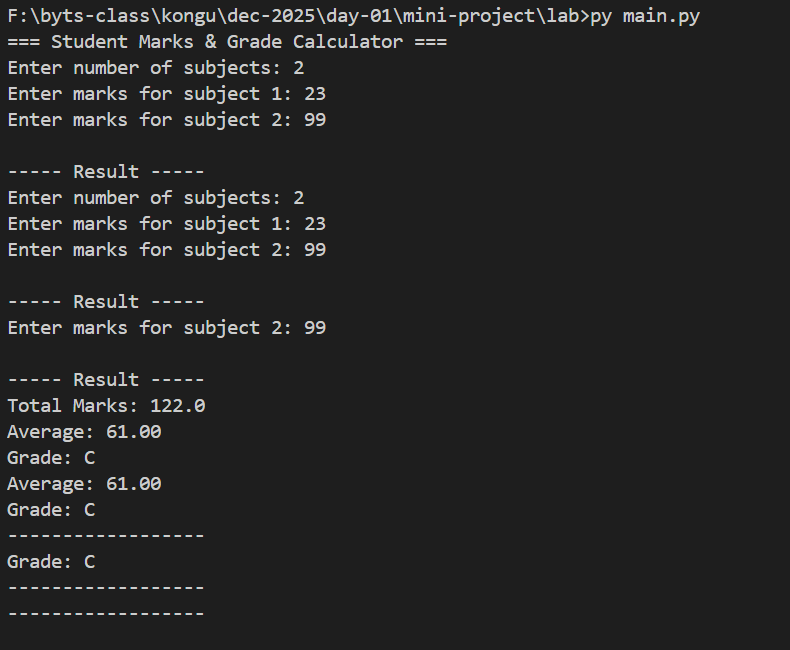

## 🎯 **Goal**

Create a CLI program where the user:

1. Enters the number of subjects.
2. Enters marks for each subject.
3. The program calculates:

   * **Total marks**
   * **Average marks**
   * **Grade (A, B, C, D, or Fail)**

