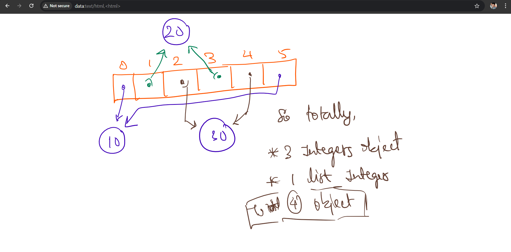
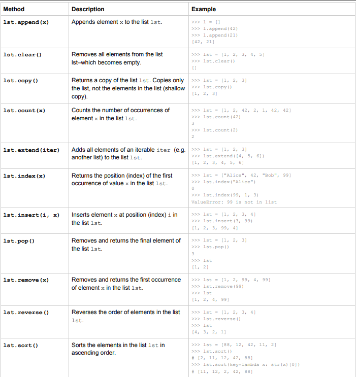

# List Operations and Methods

## LIST

- List is represented in `[]`.
- Insertion order is preserved.
- Duplicates are allowed.
- Heterogeneous elements are allowed.

```python
li = [10,20,30,20,30,10]
print(li[0])
print(li[2])
print(li[0] is li[5]) # True
```



---

`li = [10,20,30,40,50,60]`

### Accessing Elements in the List

```
positive index        0   1   2   3   4
elements             10  20  30  40  50
negative index       -5  -4  -3  -2  -1
```

Python internally introduces negative indexing from the right for easy access.

```bash
li[0]
len(li)
li[len(li)-1]
li[len(li)-2]
li[4]
li[-5]
li[25]
li[-300]
li[3.5]
li[True]
li[False]
li[3+2]
```

⚠️ While performing indexing, **boundary checking is there**.

### Access Elements in List

```python
i = 0
while i < len(li):
    print(li[i])
    i = i + 1

for item in li:
    print(item)
```

---

## Slicing

Whenever we want to work on a part of a list, we use slicing.

```
positive index        0   1   2   3   4   5   6   7   8
elements             10  20  30  40  50  60  70  80  90
negative index       -9  -8  -7  -6  -5  -4  -3  -2  -1
```

- `li[start:end]` → start = inclusive, end = exclusive  
- Always goes **left to right**

Examples:

- `li[2:6]`
- `li[-6:6]`
- `li[2:200]`  
  - Goes only till last index  
  - No boundary checking in slicing
- `li[6:2]` → empty list (`[]`)
- `li[2:]` → start optional
- `li[:6]` → end optional
- `li[:]` → entire list

---

## Step in List

Syntax: `li[start : end : step]`

```
positive index        0   1   2   3   4   5   6   7   8
elements             10  20  30  40  50  60  70  80  90
negative index       -9  -8  -7  -6  -5  -4  -3  -2  -1
```

Examples:

- `li[2:6:2]`
- `li[2:6:]`
  - +ve step → left to right  
  - -ve step → right to left
- `li[6:2:-1]`
- `li[6:2:]`
- `li[4::-1]`
- `li[4::1]`
- `li[:4:-1]`
- `li[2:6:-2]`
- `li[6:2:-2]`
- `li[::-1]`
- `li[::-2]`
- `li[2:6:0]` ❌ invalid (step cannot be zero)
- `li[:4:-1]`

---

## Modifying the List

```
positive index        0   1   2   3   4   5   6   7   8
elements             10  20  30  40  50  60  70  80  90
negative index       -9  -8  -7  -6  -5  -4  -3  -2  -1
```

```python
l1 = [10,20,30,40]
l2 = [10,20,30,40]

# creates 2 different lists
l1 is l2  # false
l1[1] = 11  # l2 is not affected
```

```bash
>>> l1 = [10,20,30]
>>> l2 = l1
>>> l1 is l2  # true
>>> l1[1] = 111
>>> # both get affected
>>> l1 == l2  # true
```

```python
l1 = l2 = [10,20,30]
li is l2
```

---

## List Concatenation

```bash
>>> l1 = [10,20,30]
>>> l2 = [40,50]
>>> l3 = l1 + l2
>>> print(l3)
>>> l3 = l1 + 10  # TypeError
```

---

## Repetition

```bash
l1 = [10,20,30]
l2 = l1 * 2
print(l2)

l2 = 11 * -5

l2 = l1 * 0

l1 = [10,20,30]
l1 = l1 + [40,50]
print(l1)

l1 = l2 = [10,20,30]
l1 += [40,50]
print(l1)
```

- Here `l1` has impact on `l2`
- `+=` **does NOT create a new list**; it modifies the same list  
- So both `l1` and `l2` change

```bash
l1 = l2 = [10,20,30]
l1 = l1 + [10,50]
print(l1)
print(l2)
```

Here assignment (`=`) creates a **new list**, so:

- `l1` becomes a new list  
- `l2` remains the old list  

So:

`a = a + x` **creates new list**  
`a += x` **modifies existing list**


